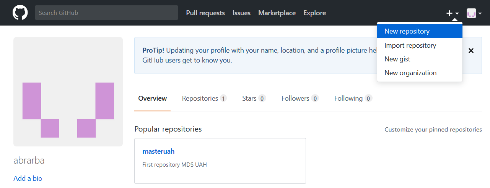
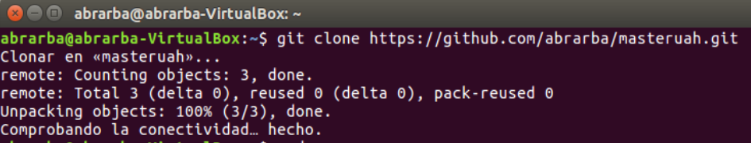

# masteruah
First repository MDS UAH
## Ejercicios básicos de Git, GitHub y Markdown
##### Repositorio masteruah
1) Crear un repositorio en vuestro GitHub llamado masteruah
<!---
Opción 1
Llamada a una imágen mediante referencia relativa al directorio del repositorio donde está guardada
-->

2) Clonar vuestro repositio en local
<!---
Opción 2
-->

3) Añadir al README.md los comanddos utilizados hasta ahora y hacer un coomit inicial con el mensaje commit inicial

* git clone https://github.com/abrarba/....
